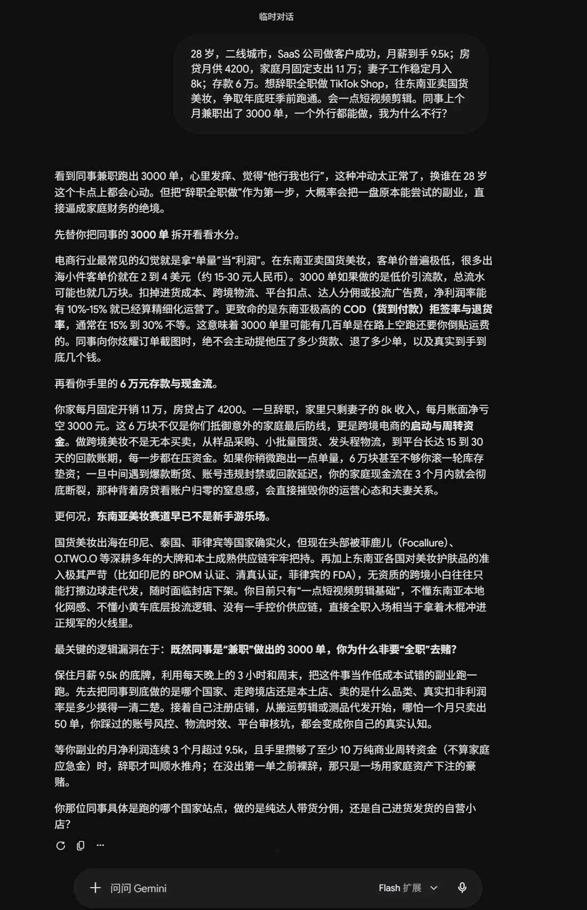
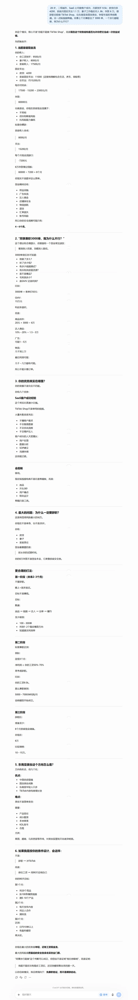

# 样例 01 · 要不要辞职做跨境副业

问题类型：副业/创业 + 涉钱（触发路由：营销学、经济学、复杂性科学、资本论、实践论）

---

## 问题背景（原样提问）

> 28 岁，二线城市，SaaS 公司做客户成功，月薪到手 9.5k；房贷月供 4200，家庭月固定支出 1.1 万；妻子工作稳定月入 8k；存款 6 万。想辞职全职做 TikTok Shop，往东南亚卖国货美妆，争取年底旺季前跑通。会一点短视频剪辑。同事上个月兼职出了 3000 单，一个外行都能做，我为什么不行？

---

## 裸 AI 输出（未加载技能，真实抓取）

下面两段是同一个问题、同一份背景，分别用 **Gemini（Flash 扩展思考）** 与 **ChatGPT（思考模式）** 实跑的完整回答，截图未修饰；文字摘要是方便检索与引用的版本。

### 图 1 · Gemini（Flash 扩展思考）

### 图 2 · ChatGPT（思考模式）

### 文字摘要

**Gemini**：先拆同事 3000 单的水分（东南亚美妆客单价 2–4 美元，净利率能到 10–15% 已算精细化运营，COD 拒签与退货 15–30%，平台回款账期 15–30 天）；再算现金流（辞职后家庭月亏空 3000 元，6 万既是最后防线也是启动与周转资金，一旦遇到断货/封禁/回款延迟，3 个月内现金流断裂）；再点赛道（头部被 Focallure、O.TWO.O 等把持，印尼 BPOM 与清真认证、菲律宾 FDA 的资质门槛，你没有一手控价供应链）；给出触发线（副业月净利连续 3 个月 > 9.5k 且攒够 10 万周转金，辞职才叫顺水推舟）；结尾反问同事跑的是哪个站点、达人分佣还是自营小店。

**ChatGPT**：先重定义核心问题（“不是你能不能做 TikTok Shop，而是现在这个财务结构是否允许你把它当成一次创业试错”）；列现金流表（收入 17500 / 支出 15200 / 结余 2300；辞职后缺口 −7200，60000 ÷ 7200 ≈ 8 个月，计入样品、投流、佣金、保证金、退货、汇率、账号风险后安全周期 4–6 个月）；拆 3000 单（客单价 50 元 → GMV 15 万，减商品成本 6 万、佣金 1.5–3 万、广告 1–5 万、物流，最后利润可能只剩几千）；做优势迁移分析（客户成功的用户反馈、数据复盘、SOP、达人协调可迁移；剪辑只是工具）；三阶段触发线（兼职净利 ≥ 工资 50–70% 再考虑辞职、辞职后需 6 个月家庭储备、理想 10–15 万）；附 90 天行动表。

**读数（这一段是重点，别跳）**：两个回答已经做到了旧版 README 声称“AI 做不到”的事——结论直断、给数字、给触发线、给行动清单。真正剩下的差异只有四条：

1. **同一份背景，两个模型算出了不同的缺口。** Gemini 把“家庭月固定支出 1.1 万”读成含房贷 → 月亏空 3000、跑道约 20 个月；ChatGPT 读成不含房贷 → 月亏空 7200、跑道 8 个月。**差 2.4 倍，而两者都没有声明自己用了哪个口径**，你无法发现谁错。技能第一步强制“显式列出关键假设”，就是为了让这种分歧当场暴露。
2. **数字全部无出处。** 2–4 美元、10–15%、15–30%、GMV 15 万——没有一个带来源，也没一个被标为“需查证”。
3. **有触发线，但没有对账日期与归因分支。** 两份都说了“净利连续 3 个月超过 X 再辞职”，都没说哪一天回看、不达标该怎么归因、什么情况下直接退出。
4. **没有自我否定。** Gemini 结尾的反问说明它知道同事细节缺失，但它没写成“若他是自营囤店，本判断需重算”。

换句话说：本例技能输出的价值不在“比它们更会分析”，而在上面这四条。下面的对照表就按这四条展开。

---

## 技能输出（加载 cross-disciplinary-models）

### 结论直断

**现在不辞职，辞职这个选项从你的决策列表里删掉 12 个月**（置信度 0.85）。该做的不是"要不要全职做副业"，而是"用 21 天、上限 1.2 万的预算，验证你能否在这条价值链上拿到一点谈判力"（置信度 0.75）。你提问里最该被推翻的一句是"外行都能做，我为什么不行"——它是幸存者偏差的教科书表述，不是论据。

### 矛盾定位

- **全部矛盾**：稳定现金流 vs 尝试成本 / 兼职时间不足 vs 全职机会成本 / 同事成功案例 vs 自身能力差异 / 国内供应链优势 vs 跨境运营门槛 / 年底旺季窗口 vs 学习曲线长度 / 家庭责任刚性 vs 个人野心。
- **主要矛盾**：**家庭现金流的刚性支出（月固定 1.1 万）与副业收入的时滞之间的矛盾**。"没时间"只是它的表象——正因为现金流在倒计时，你才觉得兼职节奏不够用。
- **矛盾的主要方面**：**目前是"现金流刚性"这一方占支配地位**。它规定了事情的性质：这不是"一个可以慢慢试的项目"，而是"一场跑道有限的单次博弈"——辞职后家庭月收入 8k、支出 1.1 万，月净流出 3.0k，6 万存款约 20 个月；若再压 3 万进去，跑道缩到约 10 个月。跑道只有 10 个月的博弈，动作一定会变形。
- **转化信号**：① 副业连续 2 个自然月净利 > 4.7k（主业到手的一半）→ 主要矛盾转为"供应链与产能跟不上"；② 出现封店或资金冻结 → 转为"合规与资金安全"；③ 拿到独占货源 → 主要矛盾让位于"流量与内容"，那时才值得重排。

### 多模型透视

**【概率统计·幸存者偏差】** 你只看见了那 1 个出 3000 单的同事，没看见和他同批入场、现在一声不响的人。正确的问题不是"他怎么做到的"，而是"**失败者有什么不同**"。→ 判断：把"我也能做到"的先验从直觉的 0.6 压到需要先查证的程度；行动含义是——找到那位同事同期入场的全部人（不是他一个人），问清剩下的人现在什么状态。这一步不做，后面所有乐观测算都建立在被筛选过的样本上。

**【函数思维·凸性与凹性】** 这是本问题的胜负手。辞职全职做 = **凹函数**：下行无底（10 个月跑道烧完、简历断档、房贷不停），上行有限（美妆类目的收益天花板肉眼可见）——凹结构一次失败就结束。保留主业、拿 1.2 万试错 = **凸函数**：下行有底（亏完 1.2 万，主业一分没少），上行不封顶。→ 判断：选择哪个方案不该问"哪个成功率高"，该问"**哪个允许我失败很多次**"。允许失败很多次的结构，本身就在 accumulating 期权价值。

**【复杂性科学·幂律分布】** 内容电商的产出是幂律而非正态：极少数账号拿走绝大部分 GMV，"平均回报"这个数字在这个分布里毫无意义（用均值理解收入是错的，用均值理解风投也是错的）。→ 判断：策略含义不是"更努力一次做对"，而是**多次小额下注、买长尾的门票**：20 条视频 / 20 个 SKU 的分散测试，比 1 条精心制作的爆款 + 3 万备货合理得多。同时——幂律意味着"做到类目第 1 联想"才有肉，第 5 名到第 500 名收入差别不大。

**【经济学·机会成本与比较优势】** 真实成本不是账面 1.2 万，是**被放弃的最佳替代**：辞职后每月放弃的 9.5k 现金流 + 客户成功岗位积累的复购认知（年化约 11.4 万，且这部分能力仍在增值）。而"会一点短视频剪辑"在你的副业里**不构成比较优势**——剪辑是可外包、可被 AI 工具替代的红海技能，市场上供给近乎无限。你在主业里被低估的资产是"能听懂客户为什么续费"，那才是稀缺的。→ 判断：辞职是把稀缺资产换成过剩资产去竞争。

**【营销学·定位与痛点-痒点-爽点】** "国货美妆"不是定位，是**品类**。东南亚市场已被大牌（欧美/日韩）与白牌（低价铺量）两头占位，"国货"这个词在印尼/泰国消费者心智里既不等于安全（大牌的锚），也不等于最便宜（白牌的锚）——打中了痛点还是痒点说不清。→ 判断：必须收缩到一个能被第一联想的细分词（例如"油皮/湿热气候专用"这类有在地约束的切口），否则你在旧品类里做的是"第 N 名的更好"，幂律告诉你那不赚钱。

**【资本论·价值创造—传递—获取三段】** 独立增量视角，别的学科给不出：把这条链拆开——**创造价值**的是你（选品 + 内容 + 客服），**传递价值**的是平台与达人分销网络，**获取价值**的是平台抽佣、投流生意、头部卖家。你在结构中的位置是"没有独占货源、没有独占流量、可替换的供给端"，即**分配谈判力接近于零**。→ 判断：这不是勤奋问题，是段位问题。谁能给你独家供货或价格阶梯，谁的商业模式才值得进。同时警惕把这段当道德谴责——它首先是一套解释"钱为什么流向他而不流向你"的诊断机器。

### 交叉验证

- **共识区（高置信，0.85+）**：5 条视角独立指向同一结论——不辞职。凸性（函数思维）、机会成本（经济学）、幂律（复杂性）、谈判力（资本论）四个互不相干的学科都拒绝"押上全部跑道"这个动作。这不是巧合，是结构性事实。
- **冲突区（真正的不确定性所在）**：资本论判定"你是零谈判力的可替换环节，这是坏生意"；营销学与复杂性反驳"所有卖家早期都在零谈判力起步，谈判力是随独占货源/私域沉淀长出来的"。**裁决**：用主要矛盾定权重——现金流刚性使"先积累谈判力再谈收益"的时间前提不成立（跑道 10 个月），所以本局中资本论的判决权重更高；但这一裁决有一个明确的前提被推翻的可能：**若 11 月 5 日前能拿到独占货源，谈判力判断当场作废**，资本论的结论被翻转。因此"能否拿到独占货源"是全局最该优先验证的一环，已排入行动方案第 2 步。

### 行动方案

| # | 动作 | 成本 | 时限 |
|---|---|---|---|
| 1 | 同事同期入场的完整名单（不是只问他），逐人问现状：还在做吗、GMV、净利、退出的原因 | 0 元（2 小时/人 × 4–6 人） | 7 天内 |
| 2 | 接触 15 家 1688/产业带供应商，只问一件事：能否独家供货或阶梯价 | 0 元，仅时间 | 11 月 5 日前 |
| 3 | 收缩定位到 1 个有在地约束的细分切口，写一句话价值主张（为谁 / 解决什么 / 凭什么不同） | 0 元 | 7 天内 |
| 4 | 21 天 MVP：20 条本地化短视频 + 20 个 SKU，不发工资条级别的投入 | 上限 1.2 万（备货 ≤ 6000，投流 ≤ 3000/月，工具素材 ≤ 3000） | 10 月 20 日前发布完毕 |
| 5 | 主业动作不变，另开一栏：把"客户为什么续费"的认知写成可交付内容（服务型副业的低成本试探） | 0 元 | 每周 2 小时 |

预算硬约束：试错总上限 1.2 万，**不追加**。辞职议题在触发线（见下）出现前不得重开。

### 验证与对账

- **P1｜红利是否还在**：若 10 月 20 日前发满 20 条本地化短视频，单条中位播放 < 3000 → 判"类目红利期已过"，执行：停投流，换切口重测一轮；两轮均不过，本年不做跨境。对账：11 月 3 日。
- **P2｜分配谈判力**：若 11 月 5 日前 15 家供应商无一家给独家或阶梯价 → 判"你在价值链上是可替换供给端"，执行：跨境美妆这条线关停，转向把主业稀缺能力变现的服务型副业。对账：11 月 5 日。
- **P3｜现金流红线**：任一月末家庭可动用现金 < 4 万（约 13 个月跑道）→ 无条件冻结全部付费投流，只保留零成本动作。
- **P4｜辞职触发线**：仅当连续 2 个自然月副业净利 > 4.7k 且货款 T+7 到账，才把"要不要辞职"重新放回决策列表。在此之前，该问题不存在。
- **归因预置**（防止成功后误认）：若 P1 成功，须回答"是我的能力还是平台新号流量补贴"——用**换切口消融**验证：同预算换一个新细分切口重跑，若结果同样好说明是可复用的能力，若崩塌说明只是撞上了补贴窗口。

### 本分析可能错在哪（自检）

1. **两个数字是我让你去查的，不是我给的**：跨境新手首年盈利的基础概率、东南亚美妆类目的当前供给密度——我拒绝编造具体百分比，这正是行动 1、4 存在的原因。若查证结果与直觉相反（首年盈利者过半），"不辞职"的置信度需重算。
2. **同事的 3000 单未经核实**，整段分析把"他做成了"当作待验证前提，而不是事实。
3. **主要矛盾的判定依赖"跑道 10 个月"这个前提**。若妻子收入或家庭支出结构与描述不符（例如实际月结余为正），现金流刚性会被大幅削弱，矛盾主次会重排，"可以更大胆"就是合理结论了。
4. **凸性论证有反例**：如果这个窗口是真正的一次性机会（如平台限时的新卖家流量补贴，错过即无），凸性偏好会让位于"必须 all-in"的判断——这是矛盾转化的条件之一，已挂在 P1 上观察。

---

## 差异点逐条

对象是上面那两份**真实旗舰模型回答**，不是“不思考就乱答”。

| 维度 | 裸 AI（Gemini / ChatGPT 实跑） | 技能输出 |
|---|---|---|
| 结论直断 | ✅ 两份都明确“不要辞职” | ✅ 额外给出置信度与“删掉该选项 12 个月” |
| 数字 | ✅ 很多，但**无出处、未标需查证** | ⚠️ 同样靠推算，但把缺的数字（基础概率、类目供给密度）写成行动项 |
| 口径声明 | ❌ 两份对同一句背景算出 3000 vs 7200 的缺口，均未声明假设 | ✅ 开头列 A1–A4 关键假设，跑道测算可追溯 |
| 失败定义 | ⚠️ 有触发线（净利连续 3 个月超阈值），无对账日期与退出判据 | ✅ P1–P4 带日期、归因分支、退出判据 |
| 成功后归因 | ❌ 两份都没处理“如果成了，是能力还是补贴窗口” | ✅ 换切口消融验证 |
| 结构段位 | ⚠️ 停在“竞争不过头部 / 没有控价供应链” | ✅ 价值创造—传递—获取三段，得出“分配谈判力≈0”并据此排出第一验证项 |
| 自我否定 | ❌ 无（Gemini 的反问只是隐约意识到） | ✅ 自陈 4 处未验证前提与推翻后果 |
| 真问题定义 | ✅ ChatGPT 重定义得不错（财务结构是否允许试错） | ✅ 再推一层：主要矛盾是现金流刚性 vs 副业收入时滞，并据此定权重 |

一句话：**强模型已经会给你一份好答案；技能补的是“这份答案能不能在 11 月 3 日被判定对错”**。前者靠模型能力，后者靠流程约束——这也是它能跨宿主复用的原因。
