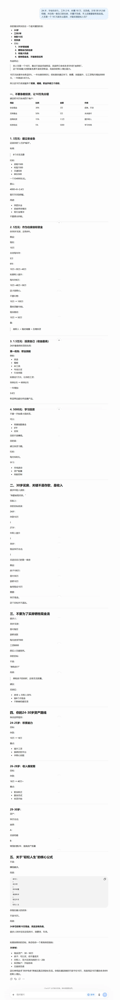
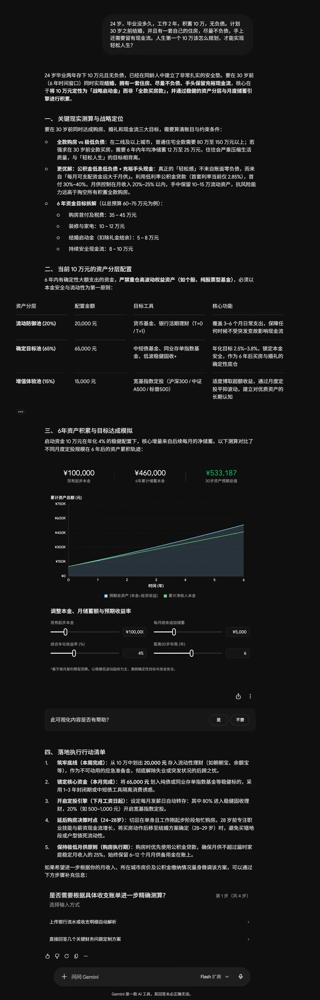

# 样例 02 · 人生第一个 10 万怎么规划才叫复利

问题类型：投资/资产配置 + 涉钱（实际调用：金融学、会计学、函数思维、投资大师思维、资本论、古代哲学 + 矛盾论、实践论收束）

---

## 问题背景（原样提问）

> 24 岁，毕业没多久，工作 2 年，积蓄 10 万，无负债。计划 30 岁之前结婚，并且有一套自己的住房，尽量不负债，手上还需要留有现金流。人生第一个 10 万该怎么规划，才能实现轻松人生？

---

## 裸 AI 输出（未加载技能，真实抓取）

同一份背景，分别用 **ChatGPT（思考模式）** 与 **Gemini（Flash 扩展思考）** 实跑的完整回答，截图未修饰。

### 图 1 · ChatGPT（思考模式）

### 图 2 · Gemini（Flash 扩展思考）

### 文字摘要

**ChatGPT**：先给结论——"重点不是追求收益，而是把它变成未来 5 年的选择权"，并指出最大财富来源不是投资收益而是收入增长能力（10 万年化 5% 一年才 5000 元；工资每月 +3000 元一年就 3.6 万）。再把 10 万拆成四个账户：安全现金 30%（3 万，约 6 个月）、买房基金 50%（5 万）、自我投资 15%（1.5 万，英语/编程/AI 工具/行业认证）、投资尝试 5%（5000 元，目的是建立习惯不是赚钱）。然后三节分别说"30 岁买房关键不是存款是收入"、"不要为买房牺牲现金流（房贷 ≤ 月收入 30%、留 6 个月现金、不影响结婚生育）"、给出 24–25 / 26–28 / 29–30 三段资产路线。最后把"轻松人生"重写成公式：**高收入 + 低负债 + 持续储蓄 + 健康身体 + 稳定关系**，并列出 30 岁的五项指标（现金资产 30–50 万、房可买但不透支、月收入至少达当前的 1.5–2 倍、投资账户开始形成、无高息负债）。

**Gemini**：先做现实测算与战略定位——全款购房需 6 年内年均净储蓄 12–25 万，与"轻松人生"相背离；更优解是**公积金低息负债 + 充裕手头现金**（首付 30–40%，月供控制在月收入 20–25%，保留 10–15 万流动资产）。再把 6 年目标拆成四个量级（首付及税费 35–45 万、装修家电 10–12 万、结婚启动金 5–8 万、持续安全现金流 8–10 万）。配置上分三池：流动防御池 20%（2 万，货基/活期）、确定目标池 65%（6.5 万，中短债/同业存单指数/低波固收+，年化 2.5–3.8%）、增值体验池 15%（1.5 万，宽基指数定投）。附一张 6 年积累曲线与可调参数表（本金 10 万、月追加 5000、年化 4%、余额 6 年 → 30 岁预期 **¥533,187**）。最后五条带时间编号的行动清单（本周完成 / 本月完成 / 下月发薪日 / 24–28 岁延后买房 / 执行期月供 ≤ 25%），并问要不要按真实流水精确测算。

**读数（这一段是重点，别跳）**：这两份回答已经把我原本想声称的优势几乎全部吃掉了——结论直断、收入端 > 投资收益、期限分账、甚至"不负债买房不可行、应该让掉这一条"（Gemini 直接算了年均需存 12–25 万而判不可行，比本例的结论更量化）。Gemini 的复利测算也自洽：按同参数复算得 ¥532,645，与它的 ¥533,187 差 0.1%。

真正剩下的差异只有四条，而且每条都能指认：

1. **有执行时间，没有判据日期。** Gemini 的"本周/本月/下月发薪日"是动作排期；两份都没写"若 X 在 T 前未达成 → 判定 Y 失效 → 执行 Z"。技能的 P1–P5 带对账日期、归因分支与退出判据。
2. **成功后如何归因，两份都没处理。** 若 30 岁真到 50 万，是收入增长能力还是撞上牛市/家庭支援？技能用变量分离把增益拆成「月净存增量」与「年化贡献」两项分别对账。
3. **没有自我否定，而且代价可指认。** ChatGPT 算"每年存 8 万、6 年 → 10 万 + 48 万 = 58 万"是纯加法，漏掉了它自己主张的复利；按同口径复利算应为 **77.6 万**。这不是笔误，是同一份回答里两处口径不一致，而没有任何地方提醒读者去查。
4. **隐含假设未集中声明。** ChatGPT 假设"每月支出 4000 左右""每年存 8 万"；Gemini 假设"二线及以上 80–150 万""公积金 2.85%""中短债 2.5–3.8%"。数字都合理，但都没标出处、没标"需查证"，也没写"若你所在城市房价翻倍，本方案哪一条先失效"。

---

## 技能输出（加载 cross-disciplinary-models）

### 结论直断

**你的问题里没有"如何让 10 万复利"这一项，它是个伪选项。** 10 万本金在 6 年里的复利效应，量级远小于同期"储蓄率"的变化——本例中提高储蓄率的终值贡献约是提升收益率的 **2.8 倍**（见下文测算）。所以真正的答案是：把这 10 万当作**安全垫，不当作资本**，把复利的主战场放到收入端与储蓄率上。（置信度 0.8）

**"30 岁前买房 + 不负债 + 留有现金流"三条不可能同时成立**，必须显式让掉一条。建议让掉"不负债"：无负债买房意味着掏空全部流动性，这会直接摧毁"手上要有现金流"这条更硬的目标。（置信度 0.75）

**"轻松人生"作为目标会被它自己摧毁**：以轻松为取向 → 回避前期必要摩擦 → 能力存量不增长 → 三十岁后更不轻松。它是本问题里唯一属于哲学层的错误前提。

### 矛盾定位

- **全部矛盾**：同一笔钱要同时充当首付与现金流（安全垫 vs 增值资本）／六年内刚性大额支出（婚礼、首付、装修）vs 长期复利所需的时间／提高储蓄率 vs 恋爱婚姻与健康投入／房产作为安全感来源 vs 作为不产生现金流的资产／人力资本增值 vs 金融资本增值争夺注意力／当下想轻松 vs 前期必要摩擦。
- **主要矛盾**：**六年内的刚性大额支出与"让本金进入长期复利"之间的矛盾**——本质是同一笔 10 万被要求同时扮演两个角色。
- **矛盾的主要方面**：**目前是"刚性支出"这一方占支配地位**。它规定了这 10 万的性质是**过渡性储备金**，不是投资本金。因此姿态是防守 + 把进攻移到收入端，而不是"配置出高收益"。
- **转化信号**：① 首付蓄水池达到目标城市门槛（≥40% 总价）→ 主要矛盾转为"选筹与负债结构"；② 主业收入年增速连续 2 年 > 8% → 人力资本路径被验证，可上调金融资产的风险敞口；③ 目标城市租金收益率回升到 > 2.5%，或房价收入比降到 6 以下 → "必须买房"的前提松动，矛盾性质改变。

### 多模型透视

**【会计学·净资产口径与现金流为王】** 先把"轻松人生"翻译成可核验口径：不是收入高，而是**净资产（资产 − 负债）与可动用现金的月数**。倒推你的历史行为：24 个月存下 10 万 → 月均净存约 **4.2k**（这个数字比你的收入更真实，也是全盘测算的起点）。→ 判断：你的财务健康度目前完全由储蓄能力决定，而非资产决定——资产端只有 10 万，几乎不产生可感知的现金流。

**【函数思维·指数与复利、凸性与凹性】** 复利公式里权重最大的是**时间与投入额**，不是收益率。按 6 年（72 个月）测算：

| 情形 | 月净存 | 年化 | 30 岁时金融净资产（含现有 10 万） |
|---|---|---|---|
| A 基准 | 4.2k | 4% | 约 **46.8 万** |
| B 只改储蓄率 | 8.4k | 4% | 约 **80.9 万**（+34 万） |
| C 只改收益率 | 4.2k | 10% | 约 **58.9 万**（+12.2 万，且 10% 长期可持续已是乐观假设） |

→ 判断：**B − A（+34.1 万）≈ 2.8 × (C − A)（+12.2 万）**。在第一个 10 万的量级上，"投什么"的权重远低于"存多少"。另外看凸性：24 岁最大的资产是**未来 40 年收入现金流的贴现值**（按现值粗算百万量级），金融资本 10 万只是零头——所以最优先的动作是保护那个大头不被一次意外（健康失业、无保险的大病、错误担保）打断，而不是给小头增值。

**【金融学·期限错配、流动性、风险收益对称】** 你的六年里有两笔**短期限刚性负债**（婚礼、首付），期限错配的定义就是"用短期负债支持长期资产"——把它搬到个人财务上：把 3 年内要用的钱放进股市，等于用流动性换不确定的收益。→ 判断：这 10 万必须先按**期限分账**，而不是按"风险偏好"分账；分账标准是"这笔钱最早什么时候必须花掉"。同时，任何"低风险高收益"的推荐都按定义不成立——它只是把风险转移给了看不见的对手方。

**【投资大师·能力圈与安全边际】** 只有 10 万本金的阶段，安全边际的个人版本不是"股票打折"，而是**12 个月的现金 + 无负债 + 不追加**；能力圈版本不是"我买了指数基金"，而是"我能说清这笔钱赚的是谁的钱、为什么轮到我赚"。→ 判断：把学投资的时间预算压到最低，把钱和注意力优先投到主业能力上——这不是保守，是在本金量级小的时候正确排序。

**【资本论·劳动力成为商品与 G-W-G′】** 独立增量视角，其他学科给不出：你的工资在马克思口径下等于**劳动力的价值**（维持你再造所需），它不增殖；钱要成为资本必须进入 G-W-G′（货币→商品→更多货币），即持有**某种剩余索取权**（股权、出租权、生意）。据此看你的两个"资产愿望"：自住房**不产生 G′**——它是预付消费，收益只体现为"省下的租金"，把它当投资会让你的判断系统性偏乐观；而 30 岁前最可行的第一个剩余索取权通常是"极小比例的股权类资产"，其现实功能不是让你发财，是**让你有资格持续观察资本如何分配**。→ 判断：不要把"买房"当成"成为资本所有者"，两者在你的量级上是两件事。

**【古代哲学·反者道之动、控制二分法】** 事物发展到极点必然向反面转化——"追求轻松"走到极端就是脆弱；斯多葛控制二分法把目标重划：可控的是储蓄率、技能、支出结构、保险，不可控的是房价、市场涨跌、行业景气。→ 判断：你的方案里所有建立在不可控变量上的部分（"赶在房价涨之前买"、"押某类资产翻倍"）都应删除；"轻松"应被替换为"**确定性**"——由 12 个月跑道和无负债带来的那种轻松，才是可复制的轻松。

### 交叉验证

- **共识区（高置信，0.85+）**：会计学、函数思维、金融学、投资大师四条视角独立指向同一结论——**先保护现金流与收入端，再谈配置**。六个模型无一支持"把这 10 万拿去搏收益"。
- **冲突区（真正的不确定性）**：会计学 + 金融学主张"10 万应作为储备金，别进权益"；投资大师 + 函数思维主张"年轻人应尽早建立长期权益敞口，否则学不会承受波动，复利时间也浪费在前 6 年"。**裁决**：用主要矛盾定权重——刚性支出占支配地位，所以**储备金优先**；但冲突本身给出一个可验证的中间解：在承诺的 12 个月安全垫之外，划出不超过 1 万进入权益类，作为"学费仓"（目的是建立能力圈，不承担增值任务）。这一裁决的可推翻条件是：**若 6 年内婚礼与首付目标被明确推迟到 32 岁之后**，刚性支出方失去支配地位，权益敞口应立即上调，冲突结论翻转。

### 行动方案

| # | 动作 | 金额 | 期限 |
|---|---|---|---|
| 1 | **期限分账**：安全垫 5 万（≥12 个月家庭最低支出，货基/短债）；首付蓄水池 3.5 万（期限与购房时间匹配的存款/中短债）；学费仓 1 万（权益类，建立承受波动的 firsthand 经验）；人力资本与应急 0.5 万（技能、体检、迁移成本） | 合计 10 万 | 即刻，且各账户不得互借 |
| 2 | **补齐保险**：百万医疗 + 定期寿险（若成为家庭主要收入方），保护的正是那个百万量级的人力资本现值 | 年保费千元级（按实际报价查证，不在此给数） | 3 个月内 |
| 3 | **把目标从"收益率"改成"储蓄率"**：30 个月内月净存 4.2k → 6k；再 30 个月 → 8.4k（对应终值 +34 万，超过任何可期的收益改善） | 0 元 | 每季度对账一次 |
| 4 | **重设买房约束**：放弃"不负债"，改为两条硬约束——月供 ≤ 家庭税后收入 25%，且月末可动用现金 ≥ 12 个月支出 | — | 购房决策前置条件 |
| 5 | **把"轻松"改写为可验证目标**：30 岁生日当月核对净资产口径，见下方 P5 | — | 2032 年当月 |

### 验证与对账

- **P1｜瓶颈位置**：若 2027-06-30 月均净存仍 < 5k → 判"瓶颈在收入端而非配置端"，执行：金融学习预算清零，全部转向主业能力与议价动作。
- **P2｜人力资本路径**：若连续 24 个月主业收入年增速 < 5% → 判"该路径失效"，执行：把人力资本与应急预算从 0.5 万提到 3 万，或开第二条收入曲线（**但不得动用首付蓄水池**）。
- **P3｜买房性质**：若目标城市 90㎡ 总价 ÷ 家庭税后年收入 > 8，且年租金 ÷ 房价 < 1.5% → 判"这是消费不是投资"，执行：推迟至 32 岁后，或改小户型/次中心。
- **P4｜负债红线**：任何时点月供 > 税后 25%，或可动用现金 < 12 个月支出 → 无条件停止一切追加投入，先修复流动性。
- **P5｜30 岁对账（净资产口径）**：2032 年当月，(房产市值 − 剩余贷款) + 金融资产 ≥ **45 万** → 路径成立；35–45 万 → 部分成立（储蓄率提升不及预期，收入端是下一阶段主攻）；< 35 万 → 前提被证伪，须重构收入结构而非优化配置。
- **归因预置**：若 P5 达成且高于 45 万，须回答"是储蓄率还是运气（收入意外上涨/资产牛市）"——用**变量分离**检验：把增益拆解为「月净存增量」与「年化贡献」两项分别对账，若年化贡献占比 > 1/3，则下次不要把它当作能力复制。

### 本分析可能错在哪（自检）

1. **月均净存 4.2k 是从"24 个月存 10 万"倒推的**，若其中包含年终奖、家里给的钱或一次性收入，则储蓄率的真实基线更低，情形 A/B 的对比要重算（B 的可行性下降）。
2. **婚礼与首付的量级我没有你的城市数据**：总价、首付比例、婚礼支出三项必须你填。若目标是一线城市，"30 岁前首付"的数学缺口会大到让 P3 直接判"不买"，结论方向会变。
3. **3 倍这个数字依赖"10% 年化可持续"这一乐观假设**；如果实际可获得的年化只有 4%（无风险），那么收益率杠杆几乎为零，"只管储蓄率"的结论会更极端地成立——这个偏差方向对我有利，但我不替你假设。
4. **"让掉不负债"这一刀有反例**：若你所在家庭把无负债视为婚姻前置条件（而非财务条件），那它是刚性约束，需要改动的就是"30 岁前"这个时间点。这是矛盾的特殊性——别人的方案不适配你的语境。

---

## 差异点逐条

对象是上面那两份**真实旗舰模型回答**。

| 维度 | 裸 AI（ChatGPT / Gemini 实跑） | 技能输出 |
|---|---|---|
| 结论直断 | ✅ 两份都有明确取向 | ✅ 额外带置信度 |
| 收入端 > 投资收益 | ✅ ChatGPT 已给出同一定性结论 | ✅ 把它算成 2.8 倍的可复核数字（46.8 / 80.9 / 58.9 万） |
| 期限分账 | ✅ 四账户 / 三池，结构一致 | ✅ 同样分账，额外规定"各账户不得互借" |
| 不负债不可行 | ✅ Gemini 算了年均需存 12–25 万，比本例更量化 | ⚠️ 结论相同，量化强度不如它 |
| 重定义"轻松" | ✅ ChatGPT 给了可检验公式 | ⚠️ 同样重定义（→ 确定性），无优势 |
| 复利测算自洽 | ✅ Gemini 复算仅差 0.1% | ✅ 同样自洽；但 ChatGPT 的 58 万漏计复利（应为 77.6 万） |
| 判据日期与退出 | ❌ 只有动作排期与目标指标，无"未达标则如何归因" | ✅ P1–P5 带日期、归因分支、退出判据 |
| 成功后归因 | ❌ 两份都没处理 | ✅ 变量分离：拆成储蓄增量与年化贡献分别对账 |
| 自我否定 | ❌ 无（只有系统层的"请核实信息"） | ✅ 自陈 4 处未验证前提与推翻后果 |
| 假设集中声明 | ⚠️ 假设存在但散落且不可追溯 | ✅ 开头列关键假设，房价/婚礼量级标为"需你填" |
| 结构层解释 | ⚠️ Gemini 的实践结论等价（低息负债+留现金） | ✅ 多一层解释：自住房不产生 G′，是预付消费，防止把"买房"误读成"成为资本所有者" |

一句话：**在这个问题上，强模型已经能做到 90%；技能剩的价值不在分析能力，而在"能不能在 2027-06-30 和 30 岁生日当月被判对错"。**差异表里那四个 ❌ 才是本仓库该主打的东西。
